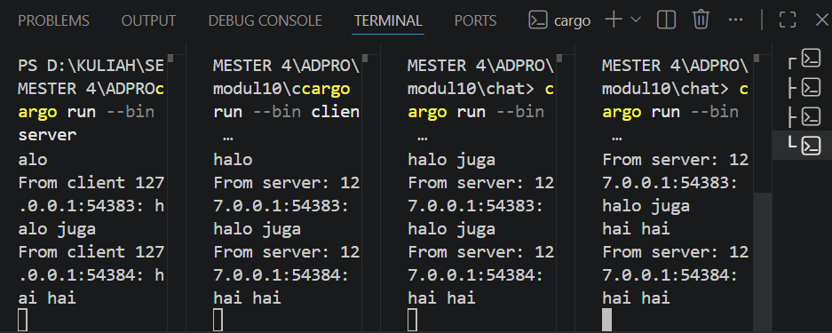

## Experiment 2.1: Original code, and how it run

### How to Run
Untuk menjalankan aplikasi chat ini, saya menggunakan beberapa jendela terminal dan menjalankan perintah berikut secara berurutan:
1. **Terminal Server**: Jalankan `cargo run --bin server` untuk mengaktifkan server di port 2000.
2. **Terminal Client**: Jalankan `cargo run --bin client` pada tiga terminal yang berbeda untuk mensimulasikan koneksi dari tiga pengguna sekaligus.

### Explanation
Aplikasi ini memanfaatkan protokol WebSocket untuk membangun komunikasi dua arah secara asinkron antara server dan banyak client. Ketika salah satu client mengirimkan pesan, data tersebut dikirim melalui *stream* yang bersifat *non-blocking* ke server. Di sisi server, pesan yang diterima akan dipancarkan kembali (*broadcast*) ke seluruh client yang terhubung menggunakan mekanisme `tokio::sync::broadcast`. Penggunaan pemrograman asinkron di sini sangat krusial karena memungkinkan setiap client untuk tetap responsif dalam menerima pesan dari server (melalui *broadcast*) sambil secara bersamaan menunggu input teks dari pengguna di terminal.

## Experiment 2.2: Modifying port
Untuk mengubah port aplikasi, modifikasi harus dilakukan pada kedua sisi koneksi yaitu pada server.rs di bagian instansiasi TcpListener::bind dan pada client.rs di bagian ClientBuilder::from_uri agar keduanya merujuk ke alamat port yang sama, dalam hal ini adalah 8080. Meskipun port berubah, aplikasi tetap menggunakan protokol WebSocket yang sama yaitu ws, yang didefinisikan melalui skema alamat dalam string URI di sisi client untuk memulai handshake asinkron dengan server. Perubahan ini membuktikan bahwa selama alamat IP dan port antara penyedia layanan (server) dan pengguna layanan (client) sudah sinkron, komunikasi data asinkron tetap dapat berjalan dengan normal tanpa mengubah logika bisnis aplikasi.